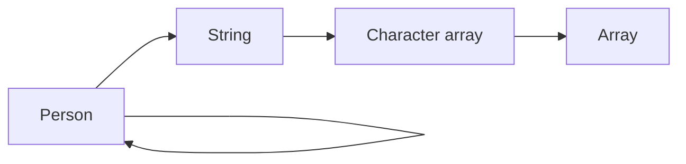
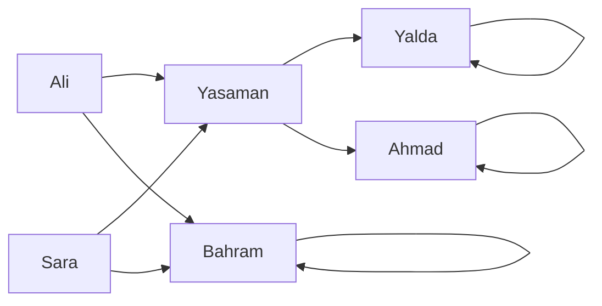
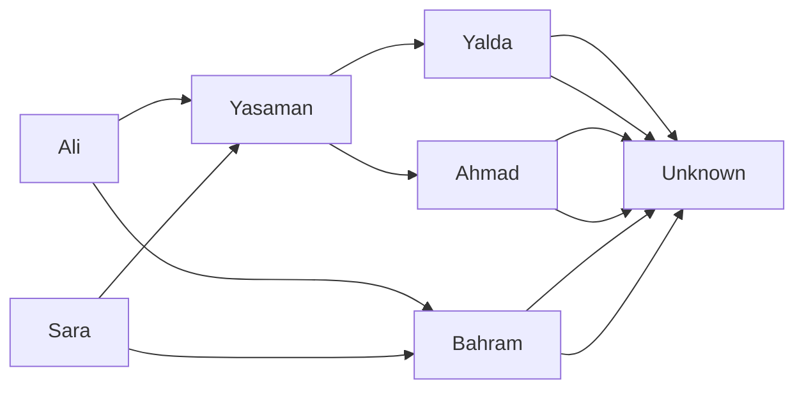
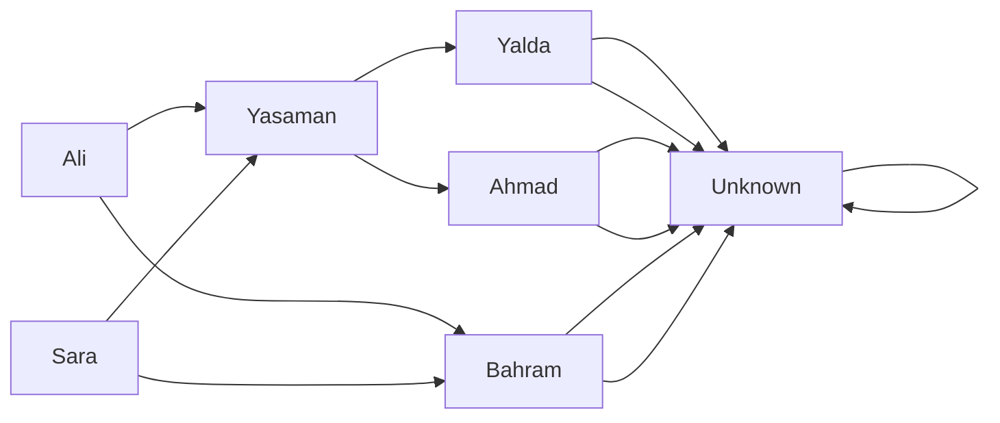

# A [semantic data model](https://en.wikipedia.org/wiki/Semantic_data_model)

It's all about **documentations**; How to express data models independent from their implementation.

In other words, this document offers a very **simple**, high-order **abstraction** to define data models.

## Entity

The word ["entity"](https://www.lexico.com/definition/entity) describes itself very well in dictionaries and here its just the same.

We call a **data model**, an entity. Real world data, lies into **instances** of entities.

> If you're familiar with [object-oriented programming](https://en.wikipedia.org/wiki/Object-oriented_programming), entity is class's cousin, and entity instances are similar to objects.

**An entity should be primitive or consist of one or more entities**. That's the key definition for entity.

The above line is obviously a recursive definition which, if observed intellectually, defines two **base cases**:

- Primitive entity
- Consist of one or more of itself

So, the two following described entities are valid,

> - The `Entity : <Entity...>` notation defines the entity on the left side of `:` consists of the entities on the right side of `:`.
>
> 	We can read `:` as 'uses' or 'consists of' or 'extended by' or 'contains.'
>
> - The `# <String>` notation is a comment and has no effect in definitions.

```yaml
Array # Primitive entity
```

```yaml
Character array : Array
```

```yaml
String : Character array
```

```yaml
Person : String, Person, Person # Self extended (A person has a mom and a dad)
```

Two questions arises:

- What happens to the `Person` instances? Infinite persons?
- Are primitive entities defined in this semantic data model?

### Entity graph

To answer the first question, let's draw these entities in a directed graph,

> Entities are nodes and there is an edge from node `A` to `B` if `A` consists of `B`.



As observed, there are two cycles in the graph. We call them entity cycles.

#### Entity cycles

Three scenarios can happen to those cycles in instances of `Person`:

##### Self link.



Obviously, in this context, this scenario should be avoided; Someone can't be parent of himself/herself.

> These are called validations and reside in the application logic which is not part of this document.

##### Continuous data.

Continuously generate data and feed to instances of `Person` to be used.

##### Terminate by special flag.



The special flag can be an error or a special value like `Unknown` which is not an instance of `Person`.

To keep it simple, we can't define this scenario in our semantic data model. It'll be part of implementation details.

> In most programming languages, database and data serialization formats, there is always a special flag  present.
>
> In Java, JSON and MySQL we have `null` as the special flag.
>
> If it has to be part of this semantic data model, it'll look like this,
>
> ```yaml
> Unknown # Primitive entity
> Person : (Person or Unknown) and (Person or Unknown)
> ```

The `Unknown` can be an instance of person if we combine this scenario with the self link scenario.



### Primitive entities

No primitive entity is defined in this semantic data model.

It's encouraged to define primitive entities when using this semantic data model.

OR, you can assume that some primitive entities are defined out of the box. For example,

- String
- Set
- List
- Integer
- Double
- ...

### Generic entities

There is no such thing defined in this semantic data model. Everything is concrete therefore should be defined. For example,

```yaml
Array # Primitive
Character # Primitive

Array of characters : Array, Character

String: Array of characters
```

BUT, you can define your own notation for generics. For example,

```yaml
Array # Primitive
Character # Primitive

# 4 examples
String: Array of characters
String: Character array
String: Array(Character)
String: Array<Character>
```

### Rule of extending

...