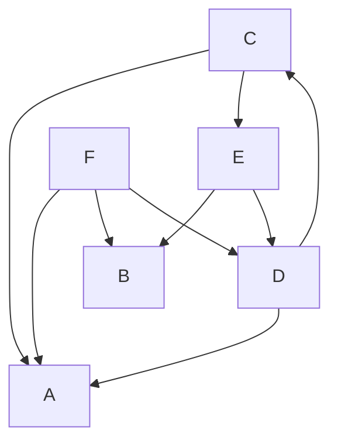

> Attention! You might be reading a NON-SENSE document.

# A [semantic data model](https://en.wikipedia.org/wiki/Semantic_data_model)

This is a fact-oriented, conceptual data model with a **bottom-up** approach.

## Intro

We'll use word "model" instead of "data model" in the rest of this document.

Every model might consist of other models.

We can transform models into a [directed graph](https://en.wikipedia.org/wiki/Directed_graph) and vice-versa. Take models as nodes and the above definition as edges.

> There is an edge from node `A` to `B` if the `A` model consists of the `B` model.

## Properties

We'll define three boolean properties about each model in the graph of models.

### Is primitive (leaf)

...

### Is intermediate

...

### Is high-order

...

## Classification

Using the above properties, we can put models into 7 [equivalence classes](https://en.wikipedia.org/wiki/Equivalence_class).

### Primitive & not intermediate & not high-order

...

### Intermediate & not primitive & not high-order

...

### High-order & not primitive & not high-order

...

### Primitive & intermediate & not high-order

...

### Primitive & high-order & not intermediate

...

### Intermediate & high-order & not primitive

...

### Primitive & intermediate & high-order

...

## Designing 

Now, let's define [top-down and bottom-up approach](https://en.wikipedia.org/wiki/Top-down_and_bottom-up_design) in **designing** models by diving into the above classifications.

### Top-down

...

### Bottom-up

...