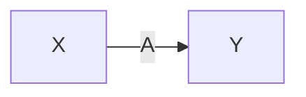
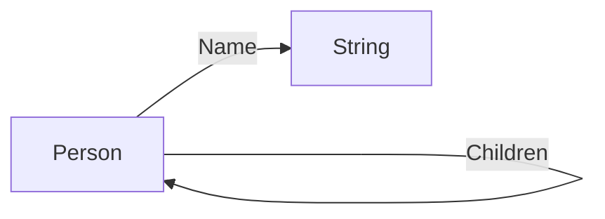

# Graph view

> Based on the [reference name](reference-name.md) extension.

In a directed graph,

Entities be **vertices** and mappings be **edges**. Each vertex/edge is identified by its associated entity/mapping **name**.

if and only if the `X` entity admits to the `A` mapping and the `A` mapping associates with the `Y` entity, then there exists an edge named `A` from vertex `X` to vertex `Y`.

Visually said,

> Using the [suggested notation](notation.md).

```
X : A
A -> Y
Y
```



## Example

Graph view of the [simple](../examples/simple.md) example,

